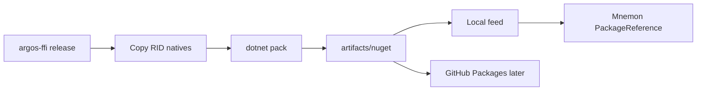

# Design — NuGet Pack & CI

## Contract alignment

All observable outputs continue to derive from `WorkspaceSnapshot`. Packaging does not introduce a second public truth model. Watching remains optional.

See `docs/architecture.md` for the frozen system contract.

## Executive decisions (locked for this epic)

| Question | Decision | Why |
|----------|----------|-----|
| **Feed for 0.1.x** | Local `artifacts/nuget` first; then **GitHub Packages** (`teamdoticca/argos`) | Mnemon dogfood without NuGet.org review friction; public NuGet.org deferred |
| **RID matrix (first impl)** | **win-x64 only** in first implementation PR | Mnemon reference consumer is Windows-first |
| **linux-x64 / osx-arm64** | Follow-on PRs after win-x64 pack + smoke green | Equal-citizen platforms; not blocking Mnemon spike |
| **Commit policy** | **Never commit natives** — CI/local produce them; `.gitignore` already covers `runtimes/**/native/*.{dll,so,dylib}` | Avoid binary drift and large diffs |
| **Versioning** | Stay on **`0.1.x`** until API/schema stability bar is met | Patch = pack/fix/native rebuild; minor = public surface change; major reserved for breaking schema |

## Pack flow

```text
cargo build -p argos-ffi --release
        │
        ▼
copy cdylib → bindings/nuget/Argos/runtimes/<rid>/native/
        │     (win-x64: argos_ffi.dll)
        ▼
dotnet pack bindings/nuget/Argos/Argos.csproj
        │
        ▼
artifacts/nuget/Argos.<version>.nupkg
        │
        ├──► local feed / NuGet.config (Mnemon dogfood)
        └──► (later) GitHub Packages push
```



## Nupkg layout (target)

```text
Argos.<version>.nupkg
  lib/net8.0/Argos.dll          # managed wrapper
  runtimes/win-x64/native/argos_ffi.dll
  runtimes/linux-x64/native/libargos_ffi.so      # later
  runtimes/osx-arm64/native/libargos_ffi.dylib   # later
```

`Argos.csproj` already packs `runtimes/**/*` via:

```xml
<None Include="runtimes\**\*" Pack="true" PackagePath="runtimes\" />
```

Consumer RID graphs must resolve natives into the app output directory (standard NuGet runtime assets). Verify with a smoke project that `DllImport("argos")` finds the library at runtime.

## csproj / consumer contract

1. Package id: `Argos`
2. TFM: `net8.0` (current; expand only if Mnemon needs another TFM)
3. Native library name: `argos_ffi` (Windows: `argos_ffi.dll`; Unix later: `libargos_ffi.so` / `libargos_ffi.dylib`) — **not** `argos`, which collides with managed `Argos.dll` on case-insensitive filesystems
4. If RID native is missing at pack time for the **declared** RID set of that release: **fail pack** (do not ship empty `runtimes/` folders as “success”)
5. If consumer runs on unsupported RID: clear `DllNotFoundException` / documented message — optional thin managed check deferred; document in smoke brief

## Failure UX

| Stage | Failure | Expected behavior |
|-------|---------|-------------------|
| Build | `argos-ffi` fails | Stop; no copy |
| Copy | Output path missing | Fail script with path + expected name |
| Pack | Declared RID native absent | Fail pack (non-zero) |
| Consume | Wrong RID / missing native | Runtime load error; README points to supported RIDs |

## Versioning policy (0.1.x)

| Bump | When |
|------|------|
| **0.1.0 → 0.1.1** | Pack/CI fix, native rebuild, docs-only packaging |
| **0.1.x → 0.2.0** | Public managed API or C ABI surface change consumers must notice |
| **1.0.0** | Deferred: schema/API stability + multi-RID CI green |

`schemaVersion` inside `WorkspaceSnapshot` is independent of package semver; document both in publish notes.

## Mnemon consume path (recommended)

1. Argos CI (or local script) produces `artifacts/nuget/Argos.0.1.x.nupkg` for **win-x64**
2. Mnemon adds a NuGet.config source pointing at that local feed **or** GitHub Packages once publish lands
3. Mnemon PackageReference: `Argos` Version `0.1.x`
4. Mnemon host RID: `win-x64` for dogfood
5. Integration tests: `ArgosWorkspace.OpenAsync` + `CurrentSnapshot` on a fixture repo; Watch optional behind feature flag
6. **Rollback during transition:** keep ability to ProjectReference `bindings/nuget/Argos/Argos.csproj` + manually place `argos.dll` beside the host — document as temporary escape hatch, not the happy path

## Rollback / coexistence

- Wrapper source stays in-tree under `bindings/nuget/`
- Until Packages feed is trusted, Mnemon may use ProjectReference
- Switching to PackageReference must not require Argos public API changes

## Platform timeline

| RID | First impl epic | Notes |
|-----|-----------------|-------|
| win-x64 | This epic (impl) | Required for Mnemon dogfood |
| linux-x64 | Follow-on | Same scripts + CI matrix row |
| osx-arm64 | Follow-on | Same scripts + CI matrix row |

## Out of scope here

- npm/napi, Watchman, architecture pivots, Mnemon code
- Committing or publishing binaries in the planning pass
